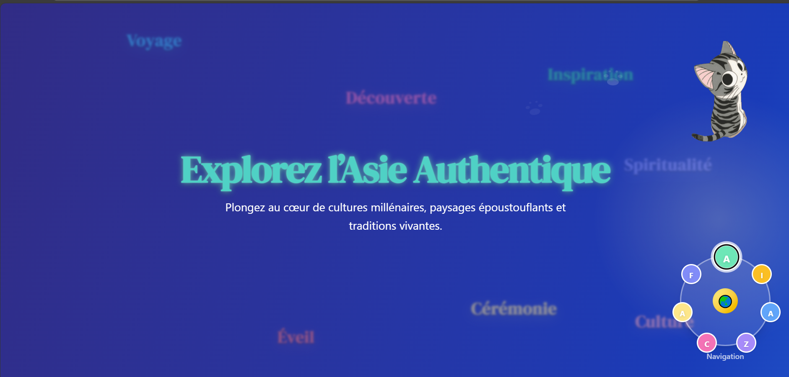

# 🌏 Asie Authentique — Template Landing Page 2025

Une landing page immersive et animée inspirée de l’Asie moderne.  
Idéale pour présenter une agence de voyage, un projet éducatif ou une expérience culturelle.

> 🚀 **Animations, mascotte, carte interactive, navigation unique, 100% responsive et accessible.**

---

## ✨ Aperçu

🖼️ [Voir la démo en ligne (Netlify)](https://authentique-asie.netlify.app/)



---

## 🚀 Fonctionnalités principales

- 🐾 **Mascotte animée** : personnage vivant qui accompagne l’utilisateur sans jamais gêner la navigation.
- 🌏 **Globe interactif** : menu de navigation immersif façon “exploration du monde”.
- 💬 **Trail de mots-clés animés** : ambiance narrative et moderne autour du titre.
- 🗺️ **Carte d’Asie interactive** : hotspots animés et points d’intérêt pour une immersion directe.
- 📸 **Carrousel 3D** : expériences et destinations présentées avec un effet dynamique et léger.
- 📱 **100% Responsive** : expérience fluide sur desktop, tablette, mobile.
- ♿ **Accessibilité** : balises aria, navigation clavier, images alt, contraste optimisé.
- ⚡ **Animations Framer Motion & GSAP** : transitions douces, storytelling vivant.
- ⭐ **Sections prêtes à vendre** : Immersion, Aventure, Bien-être, Contact, Avis, FAQ.

---

## 📦 Installation & utilisation

```bash
git clone https://github.com/yassinkh2025/template-voyage-asie
cd ton-repo
npm install
npm run dev


(Nécessite Node.js, Vite, React, Tailwind CSS, Framer Motion)

🛠️ Personnalisation
Modifie les couleurs, titres, mascotte, images dans /public et les fichiers composants.
Les sections, le globe, les hotspots et la mascotte sont entièrement paramétrables.
Ajoute de nouvelles destinations ou expériences en modifiant le carrousel et la carte.


🔒 Licence
MIT — Usage libre, mention de l’auteur appréciée !

👨‍💻 Auteur
Réalisé par Sayath

Contact : yassinkaldi385@gmail.com

💡 Inspiration
Projet imaginé pour offrir une expérience narrative et immersive dans le web moderne,
en hommage à l’Asie, à la découverte et à l’aventure.